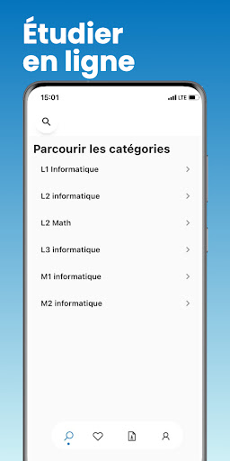
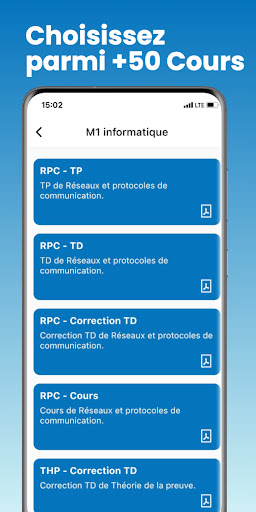
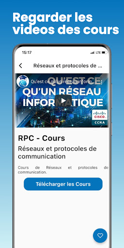
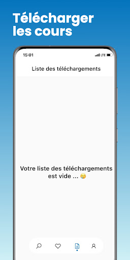
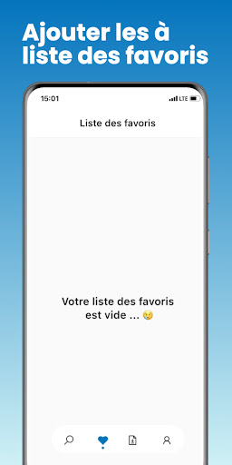

# Bac App - Flutter

Application Flutter où vous pouvez telecharger des fichier depuis une api et les désarchiver et les ouvrir et voir leur contenu , et elle inclue un lecteur de video youtube ou vous pouvez vissioner des cours grace au package youtube_player_iframe.
Le state management de l'app est fait avec GETX. 

**Using:**
- https://pub.dev/packages/get
- https://pub.dev/packages/youtube_player_iframe
- https://pub.dev/packages/url_launcher
- https://pub.dev/packages/path_provider
- https://pub.dev/packages/open_file
- https://pub.dev/packages/archive

        
